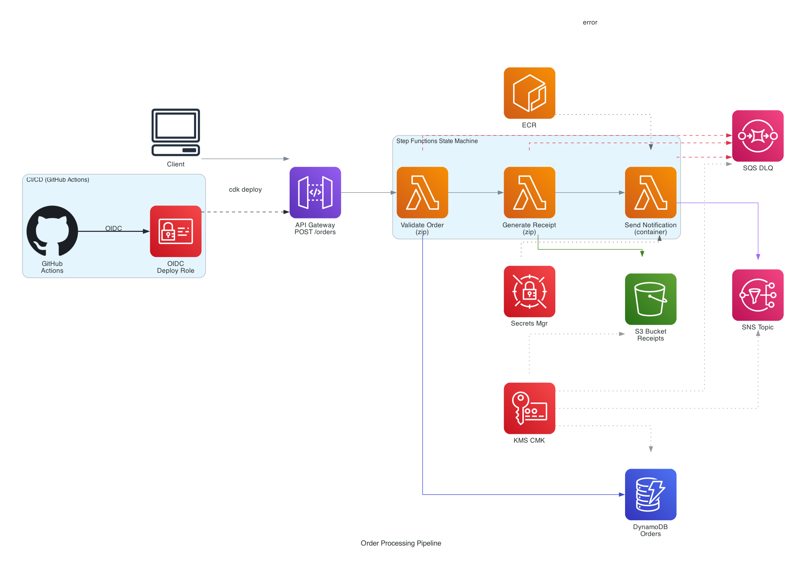

# AWS CDK Serverless Demo

End-to-end serverless order processing pipeline: **POST → API Gateway → Step Functions → Lambda (validate → receipt → notify)** with DynamoDB, S3, SNS, SQS, KMS encryption, ECR container Lambda, and GitHub Actions OIDC CI/CD. Fully CDK-provisioned, zero static secrets.

## Features

- **API Gateway** REST API with VTL request mapping to Step Functions (no router Lambda)
- **Step Functions** state machine orchestrating 3 Lambda stages with per-stage error handling
- **Lambda** ×3: two Python runtime (validate-order, generate-receipt) + one **Docker container** (send-notification via ECR)
- **DynamoDB** on-demand orders table (KMS CMK encrypted)
- **S3** receipts bucket (KMS CMK encrypted, auto-delete on stack destroy)
- **SNS** notification topic (KMS CMK encrypted)
- **SQS** dead-letter queue for failed executions (KMS CMK encrypted)
- **KMS** Customer Managed Key with auto-rotation, shared across all data stores
- **Secrets Manager** storing external webhook URL
- **ECR** container image repository for notification Lambda
- **GitHub Actions** with **OIDC federation** (workload identity, zero stored secrets)

## Architecture



Design decisions, service deep dive, and data flows: [`docs/ARCHITECTURE.md`](docs/ARCHITECTURE.md). Test screenshots: [`docs/TEST_CAPTURES.md`](docs/TEST_CAPTURES.md).

## Quickstart

```bash
# 1. Clone + install
git clone <repo-url>
cd aws-cdk-serverless-demo
npm ci

# 2. Bootstrap CDK (once per account/region)
npx cdk bootstrap

# 3. Deploy (~3-5 min, builds Docker image + provisions all resources)
npx cdk deploy --require-approval never

# 4. Smoke test (happy path)
URL=$(aws cloudformation describe-stacks \
  --stack-name OrderPipelineStack \
  --query "Stacks[0].Outputs[?OutputKey=='OrdersEndpoint'].OutputValue" \
  --output text)

curl -sS -X POST "$URL" \
  -H "Content-Type: application/json" \
  --data-binary @scripts/test-payloads/happy-path.json | jq .
# expect: {"executionArn": "arn:aws:states:...", "startDate": "..."}
```

Both test scenarios with payloads: [`scripts/test-payloads/`](scripts/test-payloads/).

## CI/CD (GitHub Actions + OIDC)

**Zero stored AWS credentials.** GitHub Actions authenticates via OIDC federation — short-lived tokens (1 hour), scoped to this repo only, no secret rotation needed. See [`docs/ARCHITECTURE.md` → CI/CD section](docs/ARCHITECTURE.md#cicd--github-actions-with-oidc) for the full OIDC flow diagram and comparison with stored keys.

Bootstrap flow (chicken-egg): deploy locally once to create the OIDC provider + IAM role, then all subsequent changes go through CI.

```bash
# After first deploy, get the role ARN
aws cloudformation describe-stacks \
  --stack-name OrderPipelineStack \
  --query "Stacks[0].Outputs[?OutputKey=='DeployRoleArn'].OutputValue" \
  --output text

# Set it as a GitHub repository secret
gh secret set AWS_DEPLOY_ROLE_ARN --body "arn:aws:iam::123456789012:role/github-actions-aws-cdk-serverless-demo"
```

Push to `main` triggers: lint (TypeScript) → synth → deploy. Docker image for the container Lambda is built and pushed to ECR as part of `cdk deploy`.

## Repo structure

```
.
├── README.md
├── cdk.json                           # CDK app config + GitHub OIDC context
├── package.json
├── tsconfig.json
├── bin/
│   └── app.ts                         # CDK app entry point
├── lib/
│   ├── order-pipeline-stack.ts        # Stack — composes constructs + OIDC
│   └── constructs/
│       ├── encryption.ts              # KMS CMK + Secrets Manager
│       ├── data-stores.ts             # DynamoDB + S3
│       ├── messaging.ts               # SNS + SQS
│       ├── processing.ts             # Lambda ×3 + Step Functions
│       └── api.ts                     # API Gateway + integration
├── lambda/
│   ├── validate-order/index.py        # Validate + DynamoDB put
│   ├── generate-receipt/index.py      # Receipt JSON → S3
│   └── send-notification/             # Docker container Lambda
│       ├── Dockerfile
│       ├── requirements.txt           # requests library
│       └── index.py                   # SNS publish + webhook POST
├── .github/workflows/
│   ├── 00-lint.yml                    # TypeScript type check
│   └── 01-deploy.yml                  # CDK synth + deploy (OIDC)
├── docs/
│   ├── ARCHITECTURE.md                # Design decisions + service deep dive
│   ├── TEST_CAPTURES.md               # End-to-end test screenshots
│   └── assets/                        # Diagram + test capture images
└── scripts/
    ├── generate-diagram.py            # Architecture diagram generator
    └── test-payloads/                 # Curl payloads for testing
        ├── happy-path.json
        └── invalid-order.json
```

## Estimated cost

| Resource | SKU | ~Monthly idle |
|---|---|---|
| Lambda ×3 | On-demand | ~$0 (free tier: 1M requests) |
| API Gateway | REST | ~$0 (free tier: 1M calls) |
| Step Functions | Standard | ~$0 (free tier: 4K transitions) |
| DynamoDB | On-demand | ~$0 (free tier: 25 WCU/RCU) |
| S3 | Standard | < $1 |
| SNS / SQS | Standard | ~$0 |
| KMS | CMK | ~$1/mo (key) + $0.03/10K requests |
| Secrets Manager | 1 secret | ~$0.40/mo |
| ECR | 1 image | < $1 |

**Total idle: ~$2-3/month.** Destroy when not needed:
```bash
npx cdk destroy --all --force
```

## Scaling beyond this demo

This demo uses a **single stack with 5 CDK Constructs** (Encryption, DataStores, Messaging, Processing, Api) — typed props, public exports, clean composition. For a production multi-environment setup:

- **Separate stacks**: promote constructs to independent stacks (`DataStack`, `ComputeStack`) — deploy independently, share via `CfnOutput` / SSM Parameter Store
- **CDK Pipelines**: self-mutating CI/CD with `Wave` for parallel environment deploys, manual approval gates for prod
- **Multi-account**: AWS Organizations with separate accounts for dev/staging/prod, cross-account deployment roles
- **Monitoring**: CloudWatch Alarms on Lambda errors + Step Functions failures, X-Ray distributed tracing, CloudWatch Dashboards
- **SNS subscriptions**: email/SMS alerts, SQS fan-out for async consumers, Lambda for custom routing
- **DLQ processing**: Lambda consumer for automatic retry, CloudWatch Alarm on queue depth > 0
- **Multi-region**: Route 53 failover, DynamoDB Global Tables, S3 Cross-Region Replication
- **Security hardening**: per-service KMS keys, VPC-bound Lambda, WAF on API Gateway, SCPs at org level
