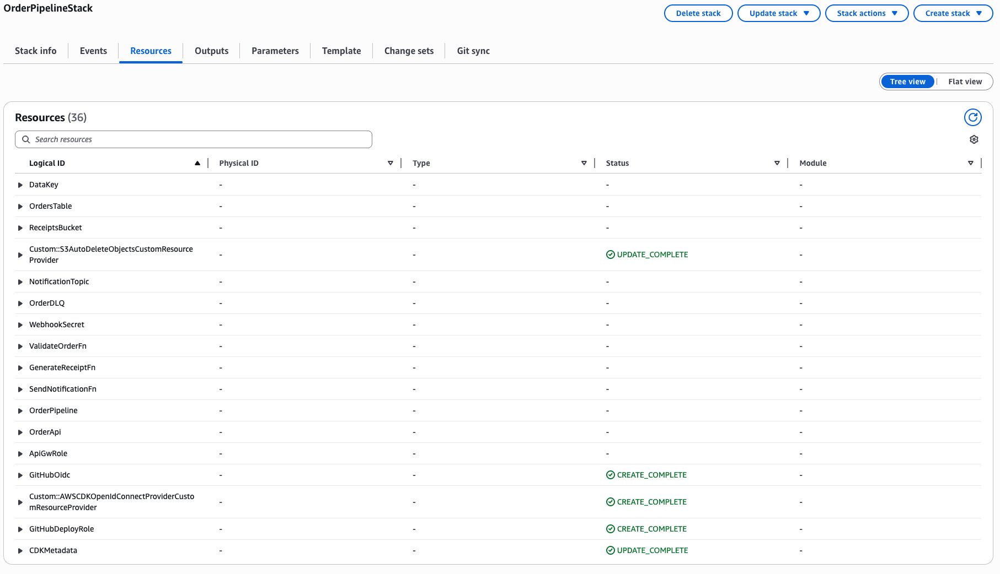
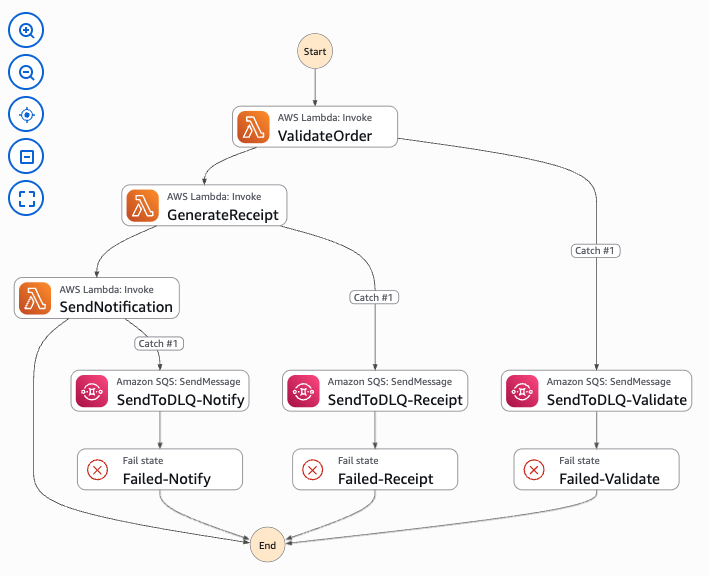

# Test Captures

End-to-end test results for the order processing pipeline. Screenshots taken from the AWS Console after deploying and running test payloads.

## Infrastructure

### CloudFormation Stack Resources

### Step Functions State Machine Definition

## Happy Path — Valid Order

**Payload:** [`scripts/test-payloads/happy-path.json`](../scripts/test-payloads/happy-path.json)

### Step Functions Execution (SUCCEEDED)

<!-- Step Functions console → Executions → select succeeded execution → Graph view -->

### DynamoDB — Order Record

<!-- DynamoDB console → Tables → select table → Explore items -->

### S3 — Receipt JSON

<!-- S3 console → select bucket → receipts/ folder → click .json file -->

### SNS — Published Messages (CloudWatch Metric)

<!-- CloudWatch console → Metrics → SNS → NumberOfMessagesPublished -->

## Unhappy Path — Invalid Order

**Payload:** [`scripts/test-payloads/invalid-order.json`](../scripts/test-payloads/invalid-order.json)

### Step Functions Execution (FAILED)

<!-- Step Functions console → Executions → select failed execution → Graph view -->

### SQS DLQ — Failed Message

<!-- SQS console → select DLQ → Send and receive messages → Poll for messages -->

## CI/CD — GitHub Actions

### OIDC Deploy Workflow (GREEN)

<!-- GitHub → Actions tab → select latest Deploy run -->

### IAM OIDC Provider

<!-- IAM console → Identity providers → token.actions.githubusercontent.com -->

