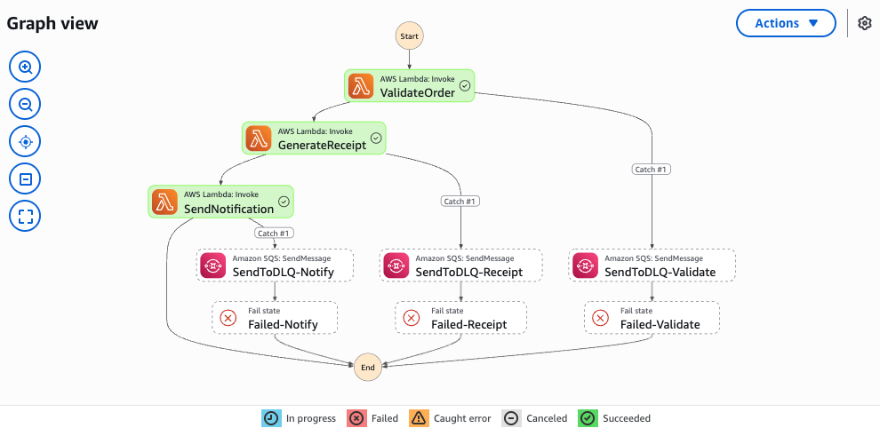
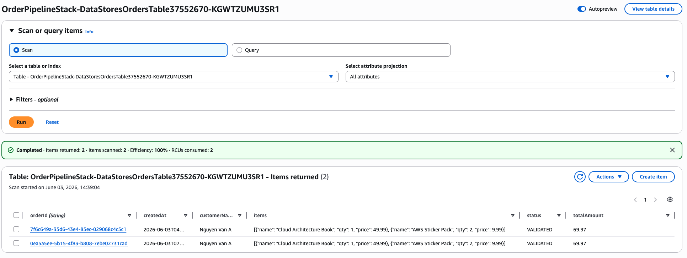
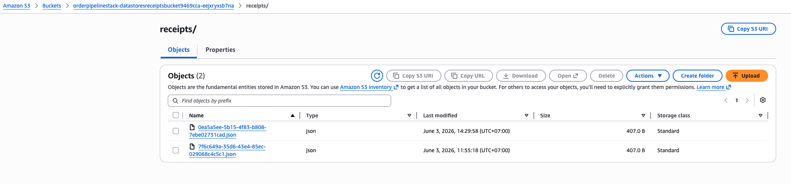
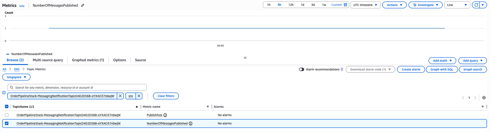
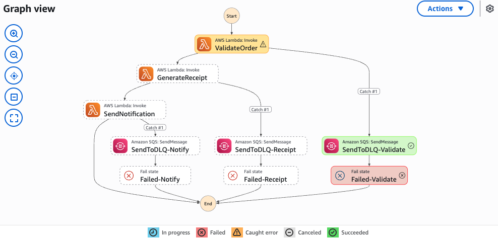
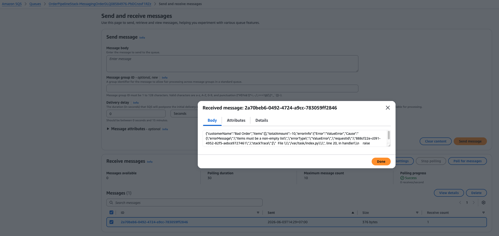
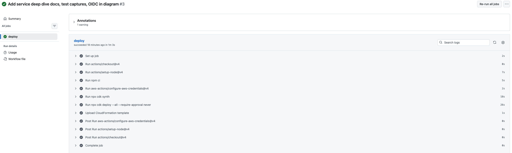
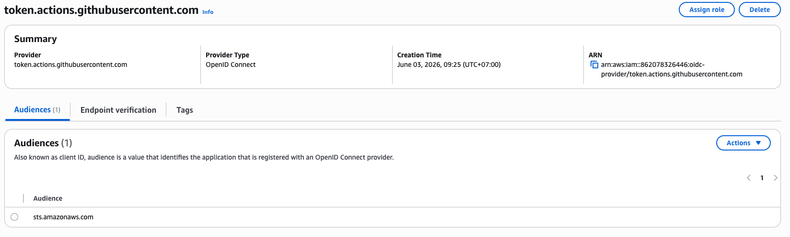

# Test Captures

End-to-end test results for the order processing pipeline. Screenshots taken from the AWS Console after deploying and running test payloads.

## Happy Path — Valid Order

**Payload:** [`scripts/test-payloads/happy-path.json`](../scripts/test-payloads/happy-path.json)

### Step Functions Execution (SUCCEEDED)

<!-- Screenshot: Step Functions console → Executions → select succeeded execution → Graph view showing green Validate → Receipt → Notify flow -->

### DynamoDB — Order Record

<!-- Screenshot: DynamoDB console → Tables → OrdersTable → Explore items → show the validated order row -->

### S3 — Receipt JSON

<!-- Screenshot: S3 console → ReceiptsBucket → receipts/ folder → show the .json file (or its content) -->

### SNS — Published Messages (CloudWatch Metric)

<!-- Screenshot: CloudWatch → Metrics → SNS → NumberOfMessagesPublished → show the metric incrementing -->

## Unhappy Path — Invalid Order

**Payload:** [`scripts/test-payloads/invalid-order.json`](../scripts/test-payloads/invalid-order.json)

### Step Functions Execution (FAILED)

<!-- Screenshot: Step Functions console → Executions → select failed execution → Graph view showing red at Validate stage, then DLQ path -->

### SQS DLQ — Failed Message

<!-- Screenshot: SQS console → OrderDLQ → Send and receive messages → Poll → show message with error details -->

## CI/CD — GitHub Actions

### OIDC Deploy Workflow (GREEN)

<!-- Screenshot: GitHub Actions → Deploy workflow → show all steps green including cdk deploy -->

### IAM OIDC Provider

<!-- Screenshot: IAM console → Identity providers → show token.actions.githubusercontent.com provider -->

